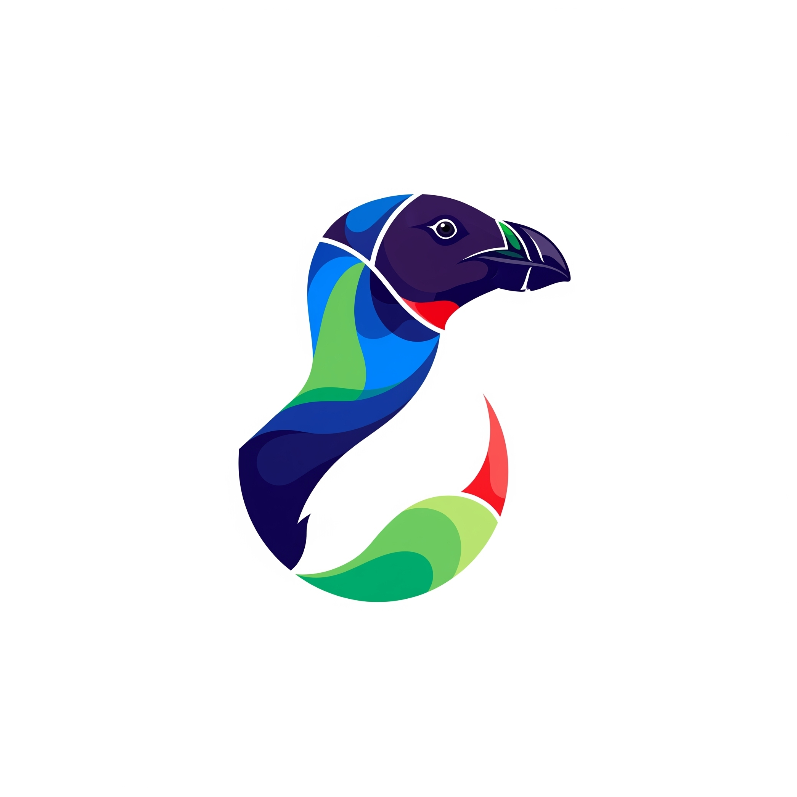

<p align="center">
  <h1 align="center">Extinct Atlas 🦤</h1>
</p>

<p align="center">

</p>

<p align="center">
  An interactive map to discover extinct animals, their habitats, and AI-powered insights.
  <br>
  Built with Svelte & Go.
</p>

<p align="center">
  <a href="https://extinctatlas.netlify.app/">
    
  </a>
  <br><br>
  <a href="#tech-stack"></a>
  <a href="#tech-stack"></a>
</p>

## Features

*   **Interactive World Map:** Explore extinct animal habitats via Leaflet.js.
*   **Detailed Animal Info:** Click polygons for images, reasons for extinction, last seen dates, physical stats, and diet.
*   **AI-Powered Q&A:** Ask questions about selected animals and get answers from an integrated AI.
*   **Responsive Design:** Works seamlessly on both desktop and mobile devices.

## Tech Stack

*   **Frontend:** Svelte, Leaflet.js, Tailwind CSS
*   **Backend:** Go
*   **Database:** MongoDB
*   **AI:** Google Gemini API

## Prerequisites

*   [Node.js and npm](https://nodejs.org/)
*   [Go](https://golang.org/dl/)
*   [MongoDB](https://www.mongodb.com/try/download/community) (instance accessible)
*   **Google Gemini API Key**

## Getting Started

1.  **Clone the Repository:**
    ```bash
    git clone https://github.com/0xSKAMI/extinctatlas.git
    cd extinctatlas
    ```

2.  **Backend (Go Server) Setup:**
    *   Navigate to the `server` directory:
        ```bash
        cd server
        ```
    *   Create a `.env` file in the `server` directory with the following content:
        ```env
        # Your Google Gemini API Key
        KEY="your_gemini_api_key"

        # Your full MongoDB connection string
        MONGO_URI="your_mongodb_connection_string"

        # Port for the Go backend server (e.g., 8080)
        PORT="8080"
        ```
        > **Note**: It's common practice to use a full `MONGO_URI` connection string for flexibility. If your code specifically requires a `PASSWORD` variable, adjust the `.env` and your Go code accordingly.
    *   Ensure Go dependencies are installed:
        ```bash
        go mod tidy
        ```
    *   Run the Go server:
        ```bash
        go run main.go
        ```
        The backend should now be running (e.g., on `http://localhost:8080`).

3.  **Frontend (Svelte Client) Setup:**
    *   Navigate to the `client` directory (from the project root):
        ```bash
        cd ../client
        ```
    *   Install dependencies:
        ```bash
        npm install
        ```
    *   **IMPORTANT for Local Development:**
        Your Svelte code may be configured to fetch data from the production URL. For local development, you must update the `fetch` URLs in your Svelte components to point to your local Go server.
        
        Look for URLs like `https://extinctatlas.duckdns.org/...` and change them to `http://localhost:PORT/...` (e.g., `http://localhost:8080/...`).
        
    *   Start the Svelte development server:
        ```bash
        npm run dev
        ```

4.  **Access the Application:**
    *   Open your browser to the URL provided by the Svelte development server (usually `http://localhost:5173`).

## Usage

*   Hover over map regions to see animal names and images.
*   Click a region to open the information panel with details.
*   Use the "Ask AI" input in the panel to ask questions about the selected animal.
*   Click "close" in the panel to return to the map.

## Contributing

Contributions are welcome! If you have suggestions or want to add a feature, please follow these steps:
1.  Fork the repository.
2.  Create your feature branch (`git checkout -b feature/AmazingFeature`).
3.  Commit your changes (`git commit -m 'Add some AmazingFeature'`).
4.  Push to the branch (`git push origin feature/AmazingFeature`).
5.  Open a Pull Request.

Please open an issue to discuss major changes before starting work.

## License

Distributed under the Apache License, Version 2.0. See `LICENSE` file for more information.

You can view the full license text online at:
[http://www.apache.org/licenses/LICENSE-2.0](http://www.apache.org/licenses/LICENSE-2.0)
